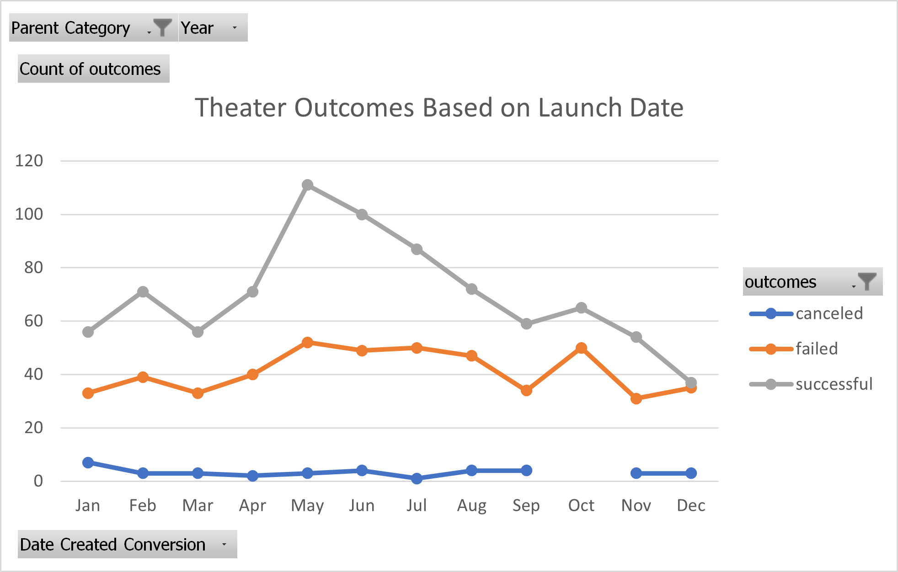

# Kickstarting with Excel

## Overview of Project
Crowdfunding Projects to uncover trends 
### Purpose
Help Louise understand how campaigns progressed given the time and goal. 
## Analysis and Challenges

### Analysis of Outcomes Based on Launch Date
Theater outcome based on launch date follow overall tread of all kickstarter projects with general change in seasonality. 

### Analysis of Outcomes Based on Goals
Failed outcomes were present in goals under 9999 but goals greater than 9999 saw successes. 
### Challenges and Difficulties Encountered
A challenge was applying formulas based on other sheets however navigating to the appropriate sheet allow the formulas to make sense.
## Results

- What are two conclusions you can draw about the Outcomes based on Launch Date?

  - Theater outcomes are more successful in May then any other month suggesting that seasonality is a factor. 

  - Similar outcomes failed and less prone to success towards Q4 but picks up in Q1 and Q2. 

- What can you conclude about the Outcomes based on Goals?

  - There were no failed outcomes with goals 500 and greater. Many successful campaigns under 15k and few successful outcomes range in the 35k to 39999 goal. 

  - Overall successful outcomes were greater than failed ones with 66% compared to 34%. 

- What are some limitations of this dataset?

  - Limitations of this dataset only dates back to 2009 where a larger sample size would show more significance. 

  - We don't have the cast data since famous actors can influence funding decisions. 

- What are some other possible tables and/or graphs that we could create?

  - We can create goals based on locations to see if geography had an influence. 

  - We can create goals based on numbers of backers to see if certain campaigns were more popular among them. 
